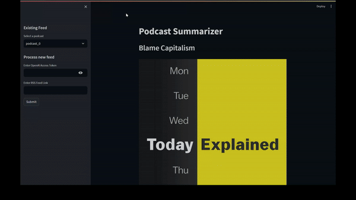
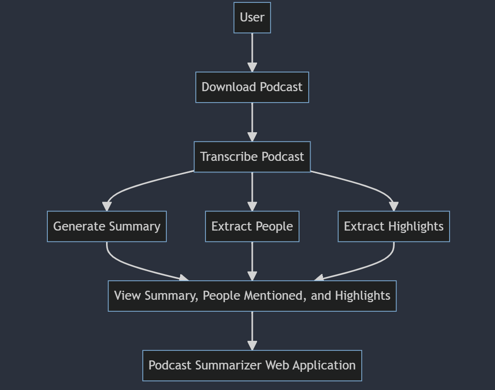

# Podcast Summarizer

Summarizing Spotify type podcasts using LLMs through OpenAI APIs

<!-- 

  

 -->

  <iframe width="560" height="315" src="assets/Demo.mp4" frameborder="0" allowfullscreen></iframe>

This project is a podcast summarizer that uses speech-to-text transcription and natural language processing to generate a summary of a podcast episode. The project consists of several Python scripts and a requirements file.

## Files

- `speech-to-text.py`: This script uses the OpenAI Whisper medium model API to transcribe a podcast episode from an audio file to a text file.
- `summary.py`: Calls GPT to generate a summary of the transcribed podcast episode.
- `extractPeople.py`: Calls GPT to extract the names of people mentioned in the podcast episode.
- `extractHighlights.py`: Calls GPT to get the highlights or key points of the podcast episode.
- `downloadPodcast.py`: Downloads a podcast episode from a given URL.
- `requirements.txt`: Lists all the Python packages and dependencies required to run the podcast summarizer.
- `app.py`: This script is the main entry point for the podcast summarizer web application.

## Usage

To use the podcast summarizer, follow these steps:

1. Install the required Python packages by running `pip install -r requirements.txt`.
2. Download a podcast episode using the `downloadPodcast.py` script.
3. Transcribe the podcast episode using the `speech-to-text.py` script.
4. Generate a summary of the podcast episode using the `summary.py` script.
5. Extract the names of people mentioned in the podcast episode using the `extractPeople.py` script.
6. Extract the highlights or key points of the podcast episode using the `extractHighlights.py` script.

# Flow

# Future Enhancements:

 - We can generate an image using Dall-E or similar text-to-image model from a short description of the podcast.

Fun Fact: Github Copilot has helped me generate descriptions for the each function in the above files also adding comments and making corrections to the variables wherever required. Most of README was also generated by Github Copilot.  